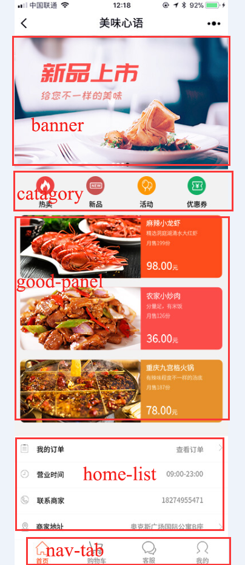

## 什么是 BEM命名规范

BEM -是由 Yandex 团队提出的一种前端命名方法论 ，即模块-元素-修饰器，相互之用`-`和`_`符号来连接。BEM 命名约定更加严格，而且包含更多的信息，尤其适用于当你在团队中进行一个大型项目时候，它的关键是光凭名字就可以告诉其他开发者某个标记是用来干什么的。

我们比较熟悉的 boostrap 框架正是使用了这种规范，事实上，大多数的框架都是采用这种命名规则，再加上命名空间规则。

## BEM的组成

* B - Block 即模块。一个页面由许多模块组成，每一个模块都是独立的，组合起来构成一个页面。如 .head 、.content、.navigate 等等。

  

* E - Element 即元素，表示每个模块下面的元素，具有某种功能，例如 Tab 下面的单个子元素，就可以命名为 .tab__item。我们在长名称中使用连字符分隔单词 ，使用两个下划线来分隔块名和元素名 。

  

* M - Modifier 即修饰符，它作为一个块或是一个元素的一种属性，代表这个块或这个元素在外观或状态上的改变。比如元素的激活状态、一个块在别的位置样式上的稍微不同等，例如.head_top、.head_bottom

  

  

在该规范中，以双下划线 __ 来作为块和元素的间隔，以单下划线  _ 来作为 块和修饰器 或 元素和修饰器 的间隔，以中划线 - 来作为 块|元素|修饰器 名称中多个单词的间隔。当然也不一定完全按照这样的分割标准，在团队中你也可以根据大家的使用习惯，规定一个大家通用的分割标准，只要按照 B-E-M 这样的组成就可以啦。

下面我们来看一下 Bootstrap 框架的命名，它是典型的按照 BEM 标准来命名的，每个组件都有自己单独的命名空间。

```
<div class="progress">
  <div class="progress-bar progress-bar-success" role="progressbar" aria-valuenow="40" aria-valuemin="0" aria-valuemax="100" style="width: 40%">
    <span class="sr-only">40% Complete (success)</span>
  </div>
</div>
<div class="progress">
  <div class="progress-bar progress-bar-info" role="progressbar" aria-valuenow="20" aria-valuemin="0" aria-valuemax="100" style="width: 20%">
    <span class="sr-only">20% Complete</span>
  </div>
</div>
```

整个组件块叫做 .progress ，组件下面的进度条元素叫做 .rogress-bar，用来区分进度条不同状态的修饰器，分别叫做 .progress-bar-success。可以看到这里 Bootstrap 也没有使用连续两个中划线或下划线。


## BEM 实践

下面有一个页面，我们尝试用 BEM 风格来编写样式。




 拿到这个页面之后，我们将它分成四个块，分别是 bannner，catagory ，good-panel ，home-list ，nav-tab，像是轮播图、导航、以及列表等通用的功能模块，建议采用统一的命名。其他的页面上的个性化功能模块，可以根据需求来命名。

第一步，先将页面大的功能模块的 html 列出来，在做页面的时候，建议都先列出页面模块，再往里面填充元素和样式。

```
<div class="banner"></div>
<div class="catagory"></div>
<div class="good-panel"></div>
<div class="home-list"></div>
<div class="nav-tab"></div>
```

接下来我们再根据设计稿填充每个模块里面的元素，这个时候可以先写好所有元素再编写样式，或者一个模块一个模块的完成，个人比较习惯单个模块的完成。

这一步开始，按照 BEM 命名规则，模块里面每个元素都要加上模块名前缀，这里我们按照标准规则，用两个下划线连接块和元素，例如`.banner__item`。用两个中划线连接修饰器，例如`.banner__item--active`表示激活状态下的banner元素。

```
<div class="banner">
    <ul>
        <li class="banner__item">
            </img>
        </li>
        <li class="banner__item--active">
        	</img>
        </li>
    </ul>
</div>
<div class="catagory">
    <div class="catagory__item">
        <i class="catagory__item__icon fas fa-fire"></i>
        <span class="catagory__item__text">热卖</span>
    </div>
    <div class="catagory__item">
        <i class="catagory__item__icon fas fa-new"></i>
        <span class="catagory__item__text">新品</span>
    </div>
    <div class="catagory__item">
        <i class="catagory__item__icon fas fa-fire"></i>
        <span class="catagory__item__text">活动</span>
    </div>
    <div class="catagory__item">
        <i class="catagory__item__icon fas fa-new"></i>
        <span class="catagory__item__text">优惠券</span>
    </div>
</div>
...
```

填充好 html 元素之后，我们就要为页面添加样式，在使用 BEM 命名规范的状态下，原则上，我们是不需要再使用后代选择器了，所有的样式都用单层选择器即可，这样也可以保证样式代码的复用率。页面的部分 css 代码如下：

```
.banner{
    width: 100%;
    height: 1.8rem;
    margin-bottom: .2rem;
    background-color: #ccc;
}
.banner__item__img{
    width: 100%;
    height: auto;
}
.catagory{
    display: flex;
    padding: 0 .1rem;
}
.catagory__item{
    flex:0 0 25%;
    display: flex;
    flex-direction: column;
    justify-content: center;
    align-items: center;
}
.catagory__item__icon{
    display: block;
    width: .4rem;
    height: .4rem;
    line-height: .4rem;
    text-align: center;
    color: #fff;
    background-color: #fb6a5d;
    border-radius: 50%;
}
...
```

那这个页面的样式代码我们就不一一列出来了，可以看到上面的我们没有使用子选择器，除此之外，还有一点是比较重要的，不论你是否使用 BEM 命名规范，都要注意，**不要使用元素选择器来定义页面的样式**，因为后期如果修改了元素，会导致维护困难，而且元素选择器渲染对于性能也是不利的。


## BEM 与原子类

原子类的写法实际上就是 Boostrap 里面的工具类，类似 `.pull-left`、.`text-center`等等，它是指一个类名只有一个样式，通常类名就是它的属性，所见即所得，写起来简单方便，很多开发者在写样式的时候，或多或少都会使用到原子类的写法。当然，关于滥用原子类会导致后期维护成本高，元素类名过于冗长等问题，也有过很多讨论。

在 BEM 命名规范中，完全可以不需要用到原子类，这样可以保证组件的完全可复用性，尤其是组件在跨项目使用的情况下，原子类往往定义在公共样式里面，如果组件依赖了原子类写法，那么在迁移组件的同时必须也要迁移公共样式，加重了负担。

那么，还有什么样的情况需要用到原子类呢，如果这个模块在项目中可复用性不强，并且可能发生改动的情况下，我们可以适当的使用原子类。尤其是一些常用的工具类，比如清除浮动，元素的浮动等。


## BEM 与命名空间
命名空间常见于各类 ui 框架里面，在所有的css类名前面加上框架的缩写。如 layui 的`.layui-row`、`.layui-col-md9`等等。因为css 样式是全局的，加上一个前缀模拟命名空间，可以将样式独立出来，避免样式之间相互影响，也方便后期添加别的样式的使用，不用在考虑命名的问题。  
比如你在使用一个 ui 框架的时候，可以将自己写的样式加上自己的项目前缀，将自定义样式与框架原有样式区分开来。例如上面的 layui 的组件，我们如果需要重新定义一些样式，可以加上一个类名`.xkd-row`、`.layui-col-md9`，依次类推。


## 页面常用模块通用名
为了保证规范和可读性，对于一些通用模块和元素，我们采取统一的命名，尤其是注意使用英文翻译，而非拼音的拼写。下面列出来的是一些常用的模块：
| 模块 | 名字 |
|---|----|
| 头部 | header |
| 容器 | content/container |
| 主体 | main |
| 菜单 | menu |
| 标签页 | tab |
| 标签栏 | tabbar |
| 尾 | footer |
| 导航 | nav |
| 侧栏 | sidebar |
| 栏目 | column |
| 包裹层 | wrapper |
| 登陆 | login |
| 广告 | bannner |
| ... | ... |


本文参考：

https://en.bem.info/methodology/key-concepts/

https://github.com/Tencent/tmt-workflow/wiki/%E2%92%9B-%5B%E8%A7%84%E8%8C%83%5D--CSS-BEM-%E4%B9%A6%E5%86%99%E8%A7%84%E8%8C%83

https://blog.csdn.net/hacke2/article/details/21707943

