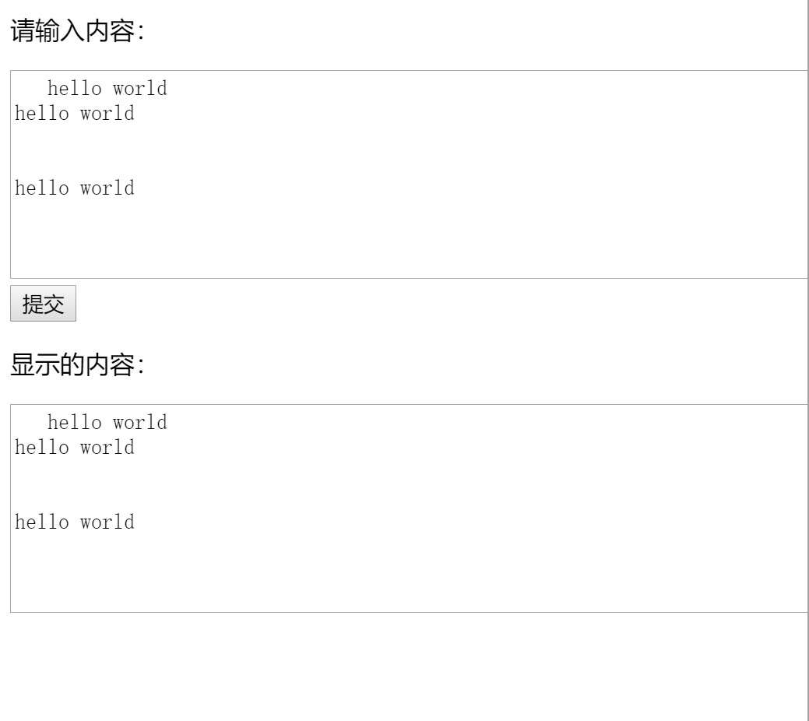
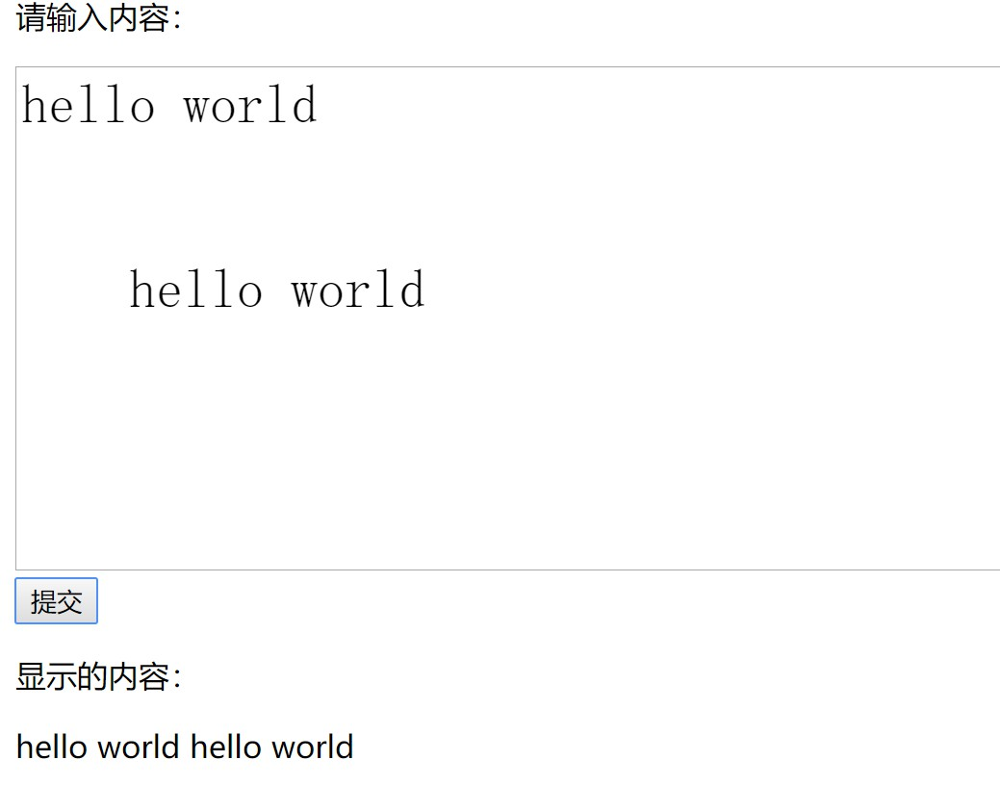
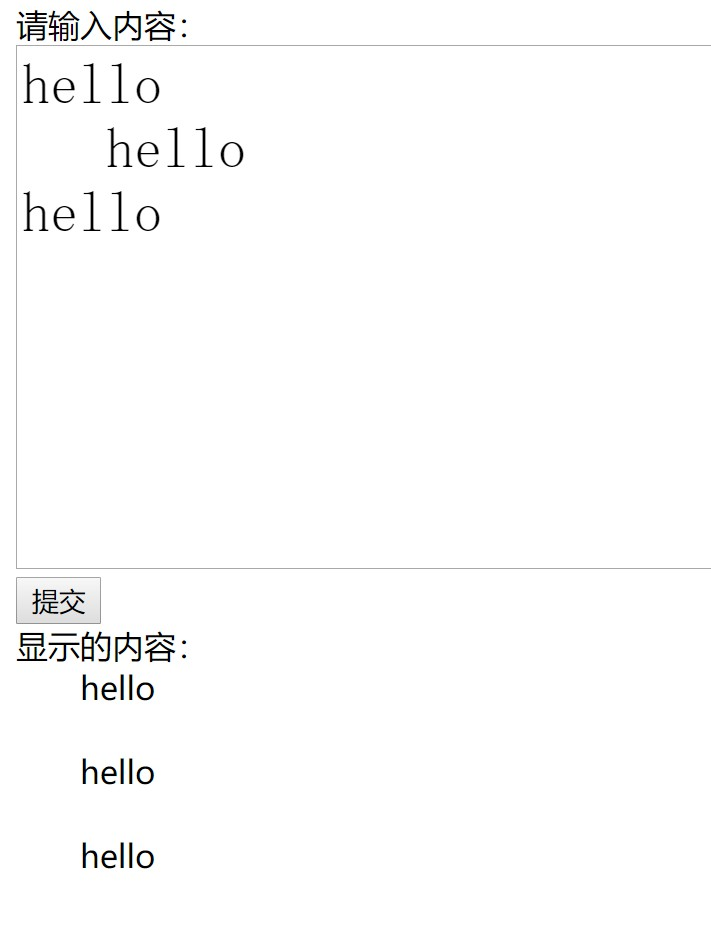
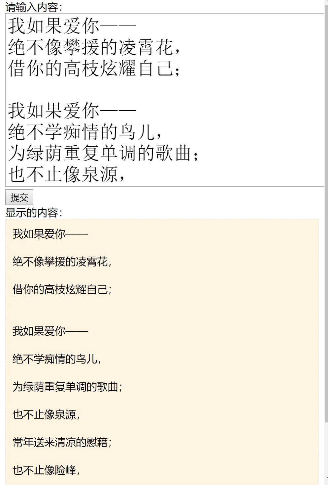
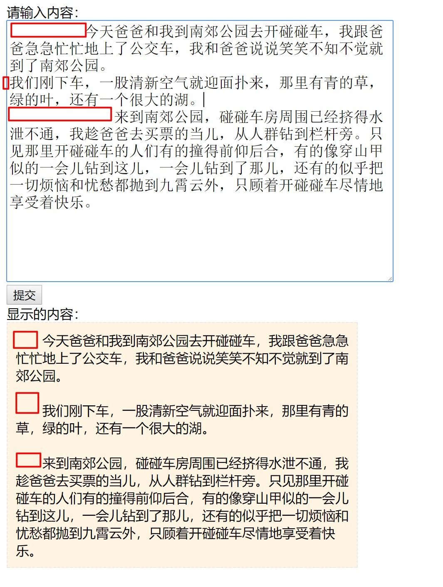

当我们使用 textarea 在前台编辑文字，并用 js 提交到后台的时候，空格和换行是我们最需要考虑的问题。在textarea 里面，空格和换行会被保存为`/s`和`/n`，如果我们前台输入和前台显示的文字都是在 textarea 里面，其实并不需要做任何处理，你在 textarea 里面编写的样式会按照你之前编辑时候的样式，正确的显示出来。

那么如果你需要 textarea 编辑提交的文字，从后台返回之后，不是显示在 textarea 里面，那么就需要考虑处理空格和换行啦。

其实之前在接触的时候，完全没有考虑过这些问题，也是因为最近做的项目里面有一个这样子的需求，要求用户在 textarea 输入文字，提交之后以文章的格式显示在页面上。不管用户输入的时候打了多少空格，默认每段文字都只缩进2个字符，且要考虑用户上传的诗歌形式，也就是每个段落之间可能有两行空白。总而言之一句话总结呢，就是—去掉用户的输入的空格，保留段落之间的换行。

那么我最终的做法就是，在保存的时候还是不做任何处理，直接保存到后台。显示的时候，从后台获取到文本之后，去掉文中的所有空格，然后显示在`<pre>`标签里面。

这里我用一个小例子来示意一下textarea在各种情况下的保存和显示。首先创建一个简单的 html 页面，为了方便获取数据和显示，我引入 vue 来处理数据，给提交按钮绑定一个点击事件，点击确定之后，显示在下面。基本的页面结构和 js 如下：

```
<div class="app">
    <p>请输入内容：</p>
    <textarea name="t1" rows="8" cols="80" v-model="text1"></textarea>
    <button>提交</button>
    <p>显示的内容：</p>
    <textarea name="t2" id="" cols="80" rows="8" v-model="text2"></textarea>
</div>

// js部分
const vm = new Vue({
    el:'#app',
    data:{
        text1:'',
        text2:''
    },
    methods:{
        submitText(){
            this.text2 = this.text1;
        }
    }
})
```


### 不处理空格和换行 显示在 textarea 里面

这一步就很简单了，直接点击提交，可以看到效果，如下图。在未做任何处理的情况下，保留了所有的空格和换行，适合保存再编辑。



### 不处理空格和换行 显示在 div 里面

把刚刚第二个 textarea 替换成 div ，效果如下图。可以看到空格和换行符都没有被处理出来，直接被忽略掉了。

```
<div id="app">
    <p>请输入内容：</p>
    <textarea name="t1" rows="8" cols="80" v-model="text1" ></textarea>
    <button @click="submitText">提交</button>
    <p>显示的内容：</p>
    <p>{{text2}}</p>
</div>
```




### 不处理空格和换行 显示在 pre 标签里面

将 div 替换成 pre 标签，将提交的文本显示在 pre 标签里面。pre 元素可定义预格式化的文本。被包围在 pre 元素中的文本通常会保留空格和换行符，他比较常见的应用就是用来显示代码，在技术网站和博客的页面里面，pre 标签都是用来包裹代码块的。

可以从下图的效果看出，pre 标签也可以完全实现保留用户所输入的空格和换行，看上去似乎能够达到我的基本需求了。**那么接下来的问题就是，如何去掉空格，并且实现自动缩进2个字符。**

```
<div id="app">
    <p>请输入内容：</p>
    <textarea name="t1" rows="8" cols="80" v-model="text1" ></textarea>
    <button @click="submitText">提交</button>
    <p>显示的内容：</p>
    <pre>{{text2}}</pre>
</div>
```

那么我试试直接给 pre 标签设置 css 属性`text-index:2em;`？这样能够实现需求吗？答案显然是不行，因为这个属性规定的是块级元素首行文本的缩进，而这里从始至终都只有一个块级元素 pre ，显然是不能实现。而且我们还要考虑到用户自己输入的空格。

### 替换空格保留换行

既然直接显示行不通，看来还是必须要处理文本，那我们就处理一下。首先尝试，去掉所有的空格，首先想到的就是`trim()`方法。思路就是，以换行符为分割，获取到每一段文本，然后用`trim()`方法去掉文本前后的空格，用 <p> 标签把每段文字包裹起来，再把每一段用`<br>`换行标签拼接起来。同时，不用`pre`标签来显示文本了，直接将处理过后的的 html 片段插入到 div 标签里面，这里用到的是 vue 的 v-html 属性。

```
<div id="app">
    <p>请输入内容：</p>
    <textarea name="t1" rows="8" cols="80" v-model="text1" ></textarea>
    <button @click="submitText">提交</button>
    <p>显示的内容：</p>
    <div v-html="text2" style="text-indent:2em;"></div>
</div>

// js部分
submitText(){
    let arr = [];
    this.text1.split('\n').forEach(item=>arr.push(`<p>${item.trim()}</p>`));
    this.text2 = arr.join('<br>');
}
```

如下图所示，基本实现自动缩进和保留换行啦。



下面我们输入一段诗歌，加上一些样式，看看最终效果如何：



再输入一段文章，输入的时候打乱文章的缩进，可以看到不管我们如何缩进，显示效果始终都是缩进两个字符，那么就实现需求啦！



