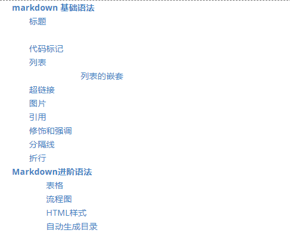

markdown 是一种简单的文本标记语言，通过一些简单的标记语法，实现文件的排版和格式，实现易读易写易修改。不少人听说他是一门语言，便打消了了解的念头，但其实 markdown 的基础语法非常简单，跟你平常记几个标点符号差不多，几分钟就能学会啦。只要你用这些基础的东西写一篇文章，基本上就可以记住了。


# markdown 基础语法

## 标题

`#` 表示标题，从一级标题往下依次字号变小，需要注意的是符号后面一定要接一个空格。

```
# 一级标题
## 二级标题
### 三级标题
#### 四级标题
##### 五级标题
###### 六级标题
```

演示：

###### 


## 代码标记

代码标记分为行内标记和代码块标记，打英文符号反引号``，中间放置你的代码，表示行内标记。三个反引号可用于生成代码块。

```
`markdown`、`html`
​```
your code chunk here
​```
```

演示：

`markdown`、`html`

```
your code chunk here
```


## 列表

列表分为有序列表和无序列表，无序列表用 `*` 、`+`、`- `都可以表示，有序列表用数字加上英文句点表示，需要注意都要在中间加上空格。

```
* list1
* list2
* list3

+ list1
+ list2

1. list1
2. list2
```

演示：

* list1
* list2
* list3
+ list4

+ list5

  

1. list1
2. list2

##### 列表的嵌套

只需要用 tab 缩进，就可以实现列表的嵌套。

```
* l1
* l2
	* s1
* l3
	* s1
	* s2
```

演示：

* l1
* l2
  * s1
* l3
  * s1
  * s2

## 超链接

超链接分为两种形式，一种是内联`[链接文字](链接地址)`直接将链接写在文字上，另外一种是引用，将所有的链接写在一起，用序号来引用。

```
// 内联
[百度一下](http:://baidu.com)

// 引用
[百度一下][1]
[再百度一下][2]

[1]: http://baidu.com/        "baidu" 
[2]: http://baidu.com/        "baidu" 
```

演示：

// 内联
[百度一下](http:://baidu.com)

// 引用
[百度一下][1]
[再百度一下][2]

[ 1]: http://baidu.com/        "baidu"
[2]: http://baidu.com/        "baidu"

## 图片

图片的写法与超链接一样，也包括内联和引用两种方式，与超链接很相似，只是前面多了一个英文感叹号，图片的链接支持相对地址。

```
// 内联


// 引用
![图片描述][1]
![图片描述][2]

[1]: https://ss0.bdstatic.com/5aV1bjqh_Q23odCf/static/superman/img/logo_top_ca79a146.png
[2]: https://ss0.bdstatic.com/5aV1bjqh_Q23odCf/static/superman/img/logo_top_ca79a146.png
```

演示：

// 内联


// 引用
![图片描述][1]
![图片描述][2]

[1]: https://ss0.bdstatic.com/5aV1bjqh_Q23odCf/static/superman/img/logo_top_ca79a146.png
[2]: https://ss0.bdstatic.com/5aV1bjqh_Q23odCf/static/superman/img/logo_top_ca79a146.png

## 引用

`>`表示引用，和列表一样也可嵌套。注意同样要在符号后面加上空格。

```
> 引用文字

> 多行引用
> 多行引用

> 嵌套引用
>> 嵌套引用
```

演示：

> 引用文字

> 多行引用
> 多行引用

> 嵌套引用
> > 嵌套引用

## 修饰和强调

修饰和强调可以为文本增加一些强调样式，包括文本加粗和文本斜体。`*`表示加粗，`_`表示斜体，注意这里文字和符号之间不要有空格。

```
这是*加粗字体*的样式。
这是_斜体_的样式。
这是**强调字体**的样式。
这也是__强调字体__的样式。
```

演示：

这是*加粗字体*的样式。
这是_斜体_的样式。
这是**强调字体**的样式。
这也是__强调字体__的样式。


## 分隔线

连续三个`***`，或者`---`，或者`___`可以表示折行，为你的文档增加更丰富的样式。

```
***
---
___
```

演示：

***
---
___


## 折行

在 markdown 中，两个空格表示折行，这一点和 word 文档不一样，不是直接回车就是折行了噢！


# Markdown进阶语法

其实掌握上面那些写法，就能满足日常写博文写文章的需求啦，当然如果你是极度完美主义，想要文章能支持更丰富的内容，也可以继续了解 markdown 的一些进阶语法，它能让你的文档内容形式更丰富。

### 表格

使用 | 来分隔不同的单元格，使用 - 来分隔表头和其他行 ，在表头下方的分隔线标记中加入 :，即可标记下方单元格内容的对齐方式。

```
| 姓名 | 年龄 | 爱好 |
| :------ | ------: | :------: |
| 左对齐 | 右对齐 | 中间对齐 |
| 张三 | 22 | 唱歌 |
| 玛格丽特 | 33 | 看电影跳舞哈哈哈哈 |
```

| 姓名     |   年龄 |        爱好        |
| :------- | -----: | :----------------: |
| 左对齐   | 右对齐 |      中间对齐      |
| 张三     |     22 |        唱歌        |
| 玛格丽特 |     33 | 看电影跳舞哈哈哈哈 |

### 流程图

是用 markdown 就能画出简洁好看的流程图，不过语法稍微要记一下，大家按需选择吧~如果使用频率较高，可以研究研究。

```
flow
st=>start: Start
op=>operation: Your Operation
cond=>condition: Yes or No?
e=>end
st->op->cond
cond(yes)->e
cond(no)->op
```

演示：

```flow
st=>start: Start
op=>operation: Your Operation
cond=>condition: Yes or No?
e=>end
st->op->cond
cond(yes)->e
cond(no)->op
```


### HTML样式

markdown 完全支持 HTML 的写法，比如上面的表格，你就可以用 html 标签来替代。

```
<a href="./baidu.com">我是html链接</a>

```

演示：

<a href="./baidu.com">我是html链接</a>


### 自动生成目录

在文档中写入`[TOC]`，即可自动生成文章目录，他是根据你的标题的层级来自动生成，如下图。



# Markdown编辑器

一般大家用的编辑器或者IDE都支持 markdown 语法，可以放心大胆直接写~此外像 Atom 、VScode等，还可以支持边写边预览，将 markdown 文件转化成 PDF 和 html 文件，方便的很~

此外，这里也推荐一个 markdown 的编辑器，typora，轻量好用，页面简洁舒适，即写即展示效果，比起文档和预览分开的编辑器看上去更清晰一些，也值得一试~