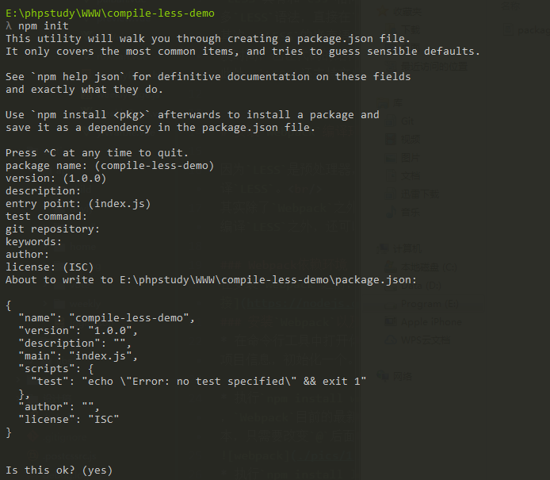
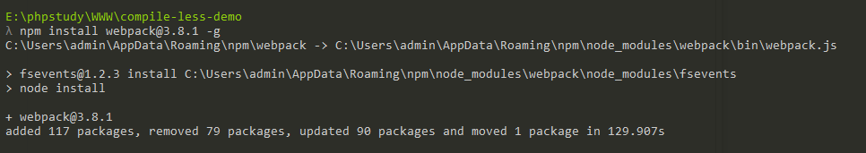
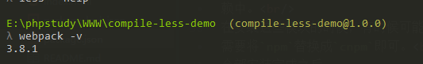
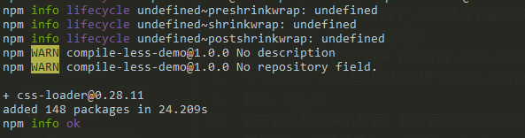

本节主要内容：
1. 什么是`LESS`
2. 为什么选择`LESS`
3. 安装`webpack`编译环境
***
# 什么是`LESS`

`LESS`是前端`css`样式预处理器中的一种，和它相同类型的语言还有`Sass`以及`Stylus`。它是`css`语言的扩展，增加了变量、混合、函数、继承等多种语法，让`css`样式的编写变得更加灵活、更易于维护。

# 为什么选择`LESS`

`LESS`具有和`css`相同的语法，只是在其之上进行了一些扩展，对于已经会`css`的开发者来说，学习成本比较低，非常容易上手。毕竟，哪怕你不会很多`LESS`语法，直接在`LESS`文件里面写`css`样式，也不会报错嘛~ 
其次，`LESS`的嵌套语法、以及变量、继承等语言特性，使得开发者在编写`css`的时候，能实现组件化的样式编写，减少重复代码的书写，不仅节省了开发时间，也让代码的结构更清晰易读。 
此外，`LESS`还支持文件的导入，将公共样式代码分门别类的以单文件形式引入，不仅结构清晰，也方便在项目后续开发中进行修改。

# 安装`Webpack`编译环境

因为`LESS`是预处理器，它的语法不能被浏览器直接识别，需要借助第三方工具把它编译成普通的`css`样式文件。在这个教程里我们使用`Webpack`来编译`LESS`。 
其实除了`Webpack`之外，`Gulp`、`Grunt`等前端工作流工具也能实现`LESS`的编译。但`Webpack`是目前前端开发中使用最多的编译工具，除了能够编译`LESS`之外，还可以实现更多强大的功能，能更好的满足项目开发的需求。所以我们还是选择用`Webpack`啦~

### Webpack依赖环境
在安装`Webpack`之前，首先确定你的电脑已经安装了`node.js`和`npm`。如果你的电脑还没有`node`环境，可以去官网下载安装。[官网链接](https://nodejs.org/en/) 
### 安装`Webpack`以及项目依赖
* 在命令行工具中打开你的项目文件夹，确定你的项目中已经有`package.json`项目文件，如果没有，在命令行中执行`npm init`，一直按`enter`设置项目信息，初始化一个。 
 
* 执行`npm install webpack@3.8.1 -g`来全局安装`Webpack`,这里的`@3.8.1`表示版本号，如果不加版本号，默认下载的就是最新版本，`Webpack`目前的最新版本是4.6.0，但是可能会有些兼容问题，为了保险起见，我这里安装的是3.8.1，你也可以根据自己的项目需求来下载不同的版本，只需要改变`@`后面的数字就行。 
 
安装完成之后，执行`webpack -v`,看到显示出版本号，就表示安装成功啦~ 
 
* 执行`npm install less`在项目中安装`LESS`,安装完成之后，你再打开`package.json`文件，会发现模块名称已经自动注入到`dependencies`里面了,同时项目下面会多了`node_modules`文件夹，这里面就是项目依赖的功能模块啦。 
 
* 然后，依次执行`npm install less-loader -d`、`npm install style-loader -d`、`npm install css-loader -d`。这里的三个`loader`分别是用来预处理`less`、将样式写入`css`、以及遍历`css`样式，而`-d`是`--save--dev`的简写，表示安装在生产环境依赖中。 
在安装这些模块的时候，有时候可能会因为网络或者其他的问题，导致安装失败。你可以尝试重新安装，或者使用淘宝镜像来安装模块，只需要将`npm`替换成`cnpm`即可。 
 

上面的都安装完成之后，我们的编译环境就基本安装完成啦！接下来我们在项目根目录下面，创建一个`webpack.config.js`，这个文件是`webpack`的配置文件，下一节我们会讲解如何配置`webpack`来编译`LESS`。
