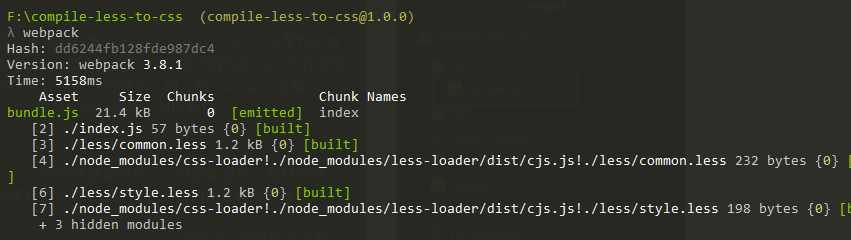
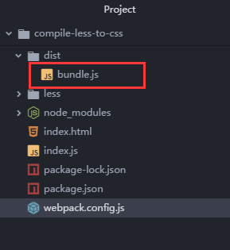
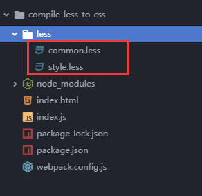
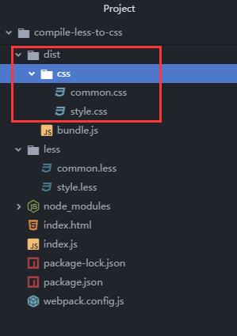
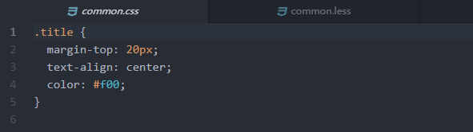
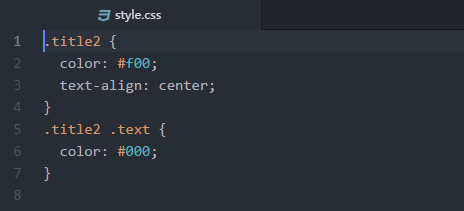

上一节安装完`webpack`编译环境之后，这节我们来配置`webpack.config.js`。主要内容包括：
1. 分析`webpack.config.js`文件基本结构
2. 配置`loaders`
3. 测试编译
***
# `webpack.config.js`配置
### `webpack.config.js`文件基本结构
因为`webpack`功能十分强大，各种`loader`加上插件能花式实现前端编译工程化，所以对于刚刚入门的开发者来说，一开始看到那些复杂的配置文件是不是眼睛都花了呢？<br/>
其实，我们只要掌握了`webpack.config.js`文件的核心结构，将它拆分出来看，就比较好理解啦~像本节所用到的配置文件，就比较简单，很适合初学者用来理解文件结构。<br/>
* 首先，`webpack`核心思想就是模块化，那么这个配置文件同样也是采用模块化的方式，最外层是`commonJS`模块化导出语法,将文件以模块化的方式导出。
    ```
    module.exports={

    }
    ```
* `entry`是`webpack`开始编译的入口文件，`webpack`会从这个文件开始，一层一层往下遍历文件，这里我们把入口文件设置成`./index`,这样`webpack`就会以项目文件夹下面的`index.js`文件为入口。入口文件一定是`js`文件，所以不用文件后缀名。
    ```
    module.exports={
        entry:'./index'
    }
    ```
* `output`可以理解为`webpack`的出口，其中`path`定义`webpack`编译出来的文件存放的位置，我们这里把编译出来的资源文件夹命名为`dist`，`__dirname`则是`node`中的全局变量，表示的是文件所在的目录，那在这里自然就表示根目录啦；而另外一个属性`filename`是定义编译出来的文件名字，最终`webpack`会编译出一个`js`文件，注意要把这个文件引入`index.html`里面噢。<br/>
所以下面这段代码的意思就是告诉`webpack`,以`./index.js`这个文件为入口，生成一个叫`bundle.js`的可执行`js`文件，并将打包编译好的文件存放在`dist`文件夹下。
  ```
  module.exports={
      entry:'./index',
      output:{
          path: __dirname+'/dist',
    	  filename: 'bundle.js'
      }
  }
  ```
  其实有了以上两个属性，`webpack`就可以正常运行啦~接下来的属性则是扩展功能,让`webpack`发挥功能的关键~
  * `module`,因为模块化是`webpack`最重要的思想，它将所有资源都看做是模块,模块就需要使用`loaders`加载器来加载，在`webpack`2.0以上的版本，旧的`loaders`被新的`rules`取代，后者允许配置`loader`以及其他更多项。
  ```
  module.exports={
      entry:'./index',
      output:{
          path: __dirname+'/dist',
    	  filename: 'bundle.js'
      },
      module:{
          rules:[

          ]
      }
  }
  ```
### `配置loader`
在本节我们所用到的是`less-loader`,`css-loader`，其中`test`表示制定文件的后缀名，`use`规定好什么格式的文件使用对应文件的`loader`。
```
module.exports={
    entry:'./index',
    output:{
        path: __dirname+'/dist',
        filename: 'bundle.js'
    },
    module:{
        rules:[
        {test: /\.css$/, use: [ 'style-loader','css-loader']},
        {test: /\.less$/, use: [ 'style-loader','css-loader','less-loader']},
        ]
    }
}
```
完成之后，可以尝试在命令行工具中执行`webpack`，这个时候，你会发现`webpack`已经成功编译，生成`dist`文件夹，在文件夹下有编译出来的`bundle.js`，但是我们并没有看到编译出来的`css`文件。因为`webpack`已经把`css`样式编译到`js`文件里面去了，其中`style-loader`会把它生成`style`标签样式，引入到`header`里面。
虽然我们没有看到单独生成的样式文件，但是样式已经引入到页面中了。


### 将`less`文件单独抽取出来
按照上面的代码配置好之后，其实`less`已经被编译出来了，但是却是被一起打包进了`js`文件里面，显然这样的效果不是我们所需要的。接下来我们还要继续配置，把`css`单独抽取出来。
这里我们要用到的插件是`extract-text-webpack-plugin`,在使用之前需要先下载~在命令行工具中执行`npm install extract-text-webpack-plugin -d`。<br/>

下载完成之后，修改刚才的配置文件。
```
 const extractComm = new ExtractTextWebpackPlugin('css/common.css');
 // 把需要生成的css文件列出来
 const extractStyle = new ExtractTextWebpackPlugin('css/style.css');
 const extractStyle = new ExtractTextWebpackPlugin('css/common.css');
```
因为我们想要实现的效果是根据`less`文件的个数，生成相对应的`css`文件。所以我们用一个函数来动态生成`loaders`的配置,并在`plugin`中生成插件。
```
/**
	 * 编译less的公用函数配置
	 * @returns {{test: *, use: *}}
	 */
	cssRuleComm = (obj, test)=> {
	    return {
	        test: test,
	        use: obj.extract({
	            fallback: "style-loader",
	            use: [{
	                loader: 'css-loader',
	                options: {}
	            }, "less-loader"],
	            allChunks: true
	        })
	    };
	};
```
最后我们来看一下最终配置完成的`webpack.config.js`文件。

```
var webpack = require('webpack');
var ExtractTextWebpackPlugin = require('extract-text-webpack-plugin');
const extractComm = new ExtractTextWebpackPlugin('css/common.css');
const extractStyle = new ExtractTextWebpackPlugin('css/style.css');

  /**
   * 编译less的公用函数配置
   * @param obj
   * @param test
   * @returns {{test: *, use: *}}
   */
  cssRuleComm = (obj, test)=> {
      return {
          test: test,
          use: obj.extract({
              fallback: "style-loader",
              use: [{
                  loader: 'css-loader',
                  options: {}
              }, "less-loader"],
              allChunks: true
          })
      };
  };

module.exports = {
    entry: {
        index: './index',  //webpack编译入口文件
    },
    output: {
        path: __dirname+'/dist', //编译到当前目录
        filename: 'bundle.js'     //编译后的文件名字
    },
    module: {
        loaders: [
          cssRuleComm(extractComm,/common.less$/i),
          cssRuleComm(extractStyle,/style.less$/i)
        ]
    },
    plugins: [
          extractComm,extractStyle
    ]
};
```
# 测试编译
按照上面的配置好之后，在根目录下面创建一个`less`文件夹，创建`style.less`和`common.less`，声明一些带有`less`语法的样式。<br/>
<br/>
在`common.less`中，使用`less`变量。
```
// common.less
@text-color:#f00;
.title{
	margin-top: 20px;
	text-align: center;
	color: @text-color;
}
```
在`style.less`中，使用`less`嵌套式语法。
```
// common.less
@text-color:#f00;
.title{
	margin-top: 20px;
	text-align: center;
	color: @text-color;
}
```
创建好样式之后，在命令行工具中执行`webpack`，如果编译成功的话，`dist`文件夹下面就会生成两个样式文件，打开样式文件，可以看到里面是普通的`css`样式。如果你顺利做到这一步，那就恭喜你，本次编译就大功告成啦~你可以根据页面需求来引入这些样式啦~<br/>



