之前的两节我们已经成功配置了`webpack`编译环境，实现了`less`的编译。这节我们来简单扩展一下`webpack`的功能，主要内容包括：<br/>
1. `webpack`热加载实现修改实时刷新
2. `webpack`压缩`css`代码
3. `webpack`构建生产环境和开发环境分离

# `webpack`热加载实现修改实时刷新
通过`webpack-dev-server`可以实现修改后实时刷新，具体详情请看本站的其他教程。[点我查看侠课岛webpack热加载教程](https://baidu.com)

# `webpack`压缩`css`代码
### 为什么要压缩`css`代码
我们在开发的时候，`css`代码都是一个属性占据一行，这样方便修改和阅读。那对于一个项目来说，几千行的样式代码是很正常不过的事情。而经过压缩之后，去掉多余的空格和行数，能够很大程度减小文件的大小，优化页面加载速度。
### 配置`css`压缩
其实这个`css`压缩配置起来很简单的啦，因为我们之前使用的`css-loader`就有这个功能，所以我们只要`loader`里面设置`options`把`minimize`选项设置为`true`，这样`webpack`在抽取样式，生成样式文件的时候，就会自动对它进行压缩。<br/>
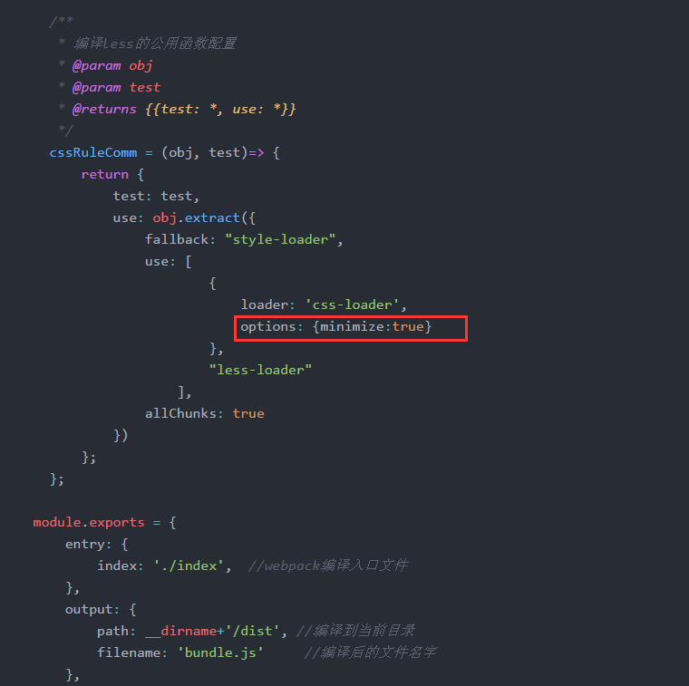<br/>
那么除了`minimize`之外，`css-loader`还提供了其他的`options`选项，大家可以看下官方文档了解下其他选项的用法。[点我去官网查看](http://www.css88.com/doc/webpack/loaders/css-loader/)<br/>
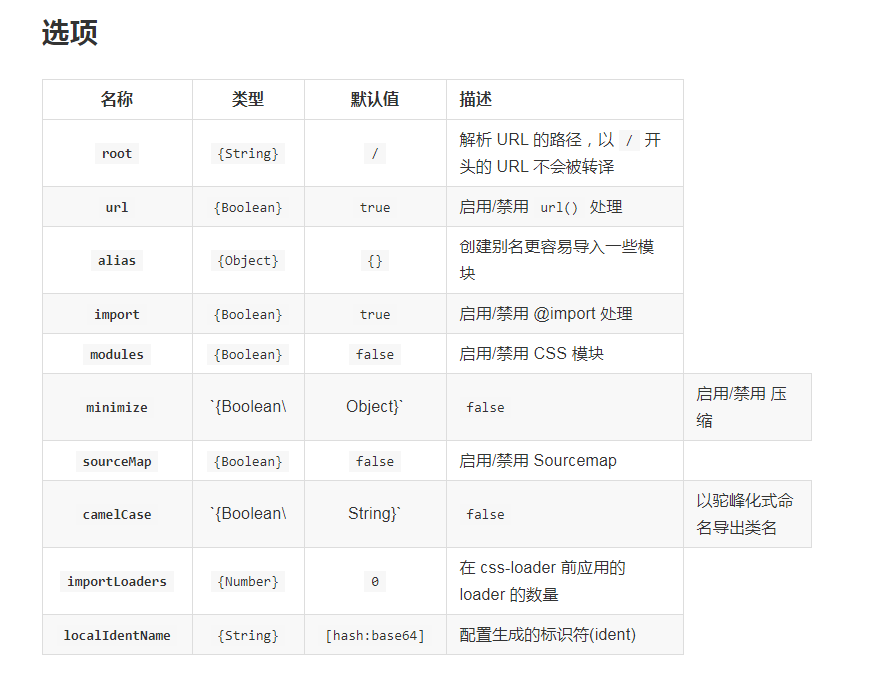<br/>


### 测试压缩效果
设置好`webpack`之后，我们来测试一下`webpack`有没有对样式文件进行压缩。首先在我们的`less`文件里面创建一些样式。<br/>
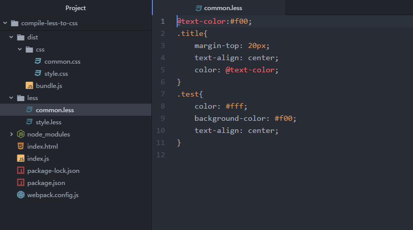<br/>
然后在命令行工具中执行`webpack`开始编译，编译完成之后，找到`dist`文件夹下面的`css`->`common.css`，可以看到文件已经是压缩过的格式啦~说明我们`webpack`已经成功压缩代码~<br/>
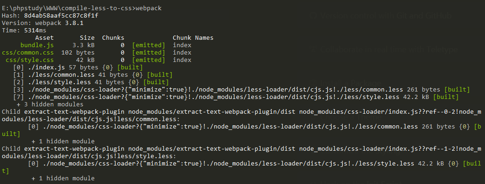
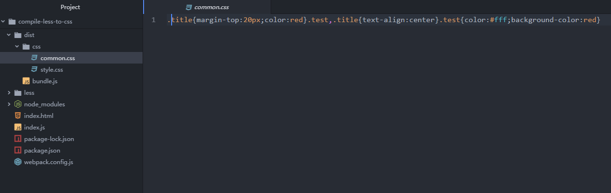


# `webpack`生产环境和开发环境配置分离
### 为什么要分离发布环境和开发环境配置
生产环境就是我们在开发项目中所使用的环境，为了优化开发流程，减少开发时间，我们会加入很多自动化的工作流程配置，比如热加载自动刷新，`css`前缀自动补全等等。<br/>
发布环境就是发布到服务器之后，就不需要那些自动化的功能了，这时候就需要将文件进行压缩，提高文件加载的速度。<br/>
所以为了满足不同环境的需求，我们就需要将`webpack`的配置区分开来，在开发环境下使用开发配置，在发布的时候使用发布配置。
### 配置`webpack`环境分离
* 首先我们要创建不同的配置文件。还是在之前的项目中，将根目录下面的`webpack.config.js`改成`webpack.prod.config.js`，这个文件做为发布环境的配置文件；拷贝一份，重新命名为`webpack.dev.config.js`，这个文件做为开发环境的配置文件；然后再创建一个文件，命名为`webpack.base.config.js`，这个文件做为公共的配置文件，承载开发环境和发布环境的相同配置，这样我们在修改一些公共的配置的时候，不用一段代码修改两次，维护起来更加方便。<br/>
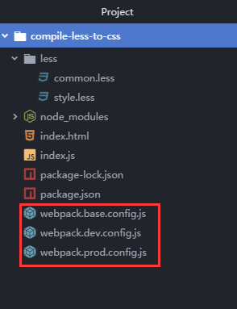<br/>
* 在配置之前,我们还需要下载一个官方插件——`webpack-merge`，用来合并公共配置和不同环境的配置文件，在命令行中执行`npm install webpack-merge -d`。通过这个插件，我们可以把公共配置和私有环境配置合并成一个完整的`webpack`配置文件。<br/>
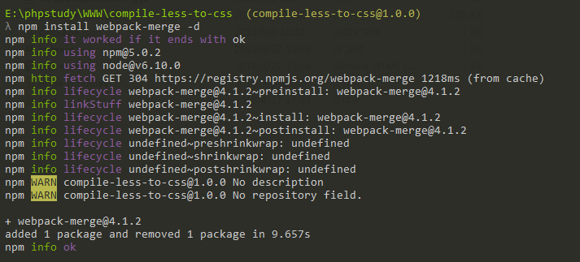<br/>
* 在`webpack.base.config.js`中，我们声明一些项目的公共配置，比如编译的入口出口，文件打包等。
    ```
    // webpack.base.config.js
    var webpack = require('webpack');
    var path = require('path');

    module.exports = {
        entry: {
            index: './index',  //webpack编译入口文件
        },
        output: {
            path: __dirname+'/dist', //编译到当前目录
            filename: 'bundle.js'     //编译后的文件名字
        }
    };
    ```

* 在`webpack.dev.config.js`中，我们配置开发环境下的编译文件。因为需要跟公共的配置文件合并，所以我们需要在文件的开头引入公共的配置和`webpack-merge`。<br/>
为了方便测试，我们继续使用这节课的编译`less`代码做为分离配置。在开发环境中，我们不压缩代码，不分离`css`样式文件，只使用最开始的`css-loader`和`less-loader`，这样配置之后，`webpack`并不会生成样式，而是直接将样式以`<style>`形式引入到`html`中。
  ```
  //webpack.dev.config.js
  const merge = require('webpack-merge');    //引入合并插件
  const baseConfig = require('./webpack.base.config.js'); //引入公共配置

  //使用merge来合并配置
  module.exports = merge(baseConfig,{
      module:{
          rules:[
          {test: /\.css$/, use: [ 'style-loader','css-loader']},
          {test: /\.less$/, use: [ 'style-loader','css-loader','less-loader']},
          ]
      }
  });
  ```

* 在`webpack.prod.config.js`中，我们使用上节讲过的`extract-text-webpack-plugin`来抽离`css`文件以及压缩`css`。这里的代码都是之前讲解过的，这里就不多说了，直接拿过来用就好啦。
  ```
  const merge = require('webpack-merge');    //引入合并插件
  const baseConfig = require('./webpack.base.config.js'); //引入公共配置
  const ExtractTextWebpackPlugin = require('extract-text-webpack-plugin');  //引入抽离css插件
  const extractComm = new ExtractTextWebpackPlugin('css/common.css');
  const extractStyle = new ExtractTextWebpackPlugin('css/style.css');

  /**
	 * 编译less的公用函数配置
	 * @param obj
	 * @param test
	 * @returns {{test: *, use: *}}
	 */
	cssRuleComm = (obj, test)=> {
	    return {
	        test: test,
	        use: obj.extract({
	            fallback: "style-loader",
	            use: [
			            {
			                loader: 'css-loader',
			                options: {minimize:true}
			            },
			            "less-loader"
			        ],
	            allChunks: true
	        })
	    };
	};

  module.exports = merge(baseConfig,{
      module: {
		  loaders: [
			cssRuleComm(extractComm,/common.less$/i),
			cssRuleComm(extractStyle,/style.less$/i)
		  ]
	  },
	  plugins: [
			extractComm,extractStyle
	  ]
  });
  ```
* 分环境配置好之后，我们还需要在`config.json`里面修改一下`script`，添加两行，实现在执行不同命令的时候，调用不同的配置文件。<br/>
`package.json`里面的`scripts`命令，语法结构为`xxx:xxxx`是用来自定义一些脚本，冒号前面的表示脚本名字，使用的时候执行`npm run xxx`。冒号后面表示要执行的内容。<br/>
这里我们分别定义一个执行开发环境脚本和发布环境的脚本。
```
"prod": "webpack --config webpack.prod.js",
"dev": "webpack --config webpack.dev.js"
```
完整`package.json`如下：<br/>
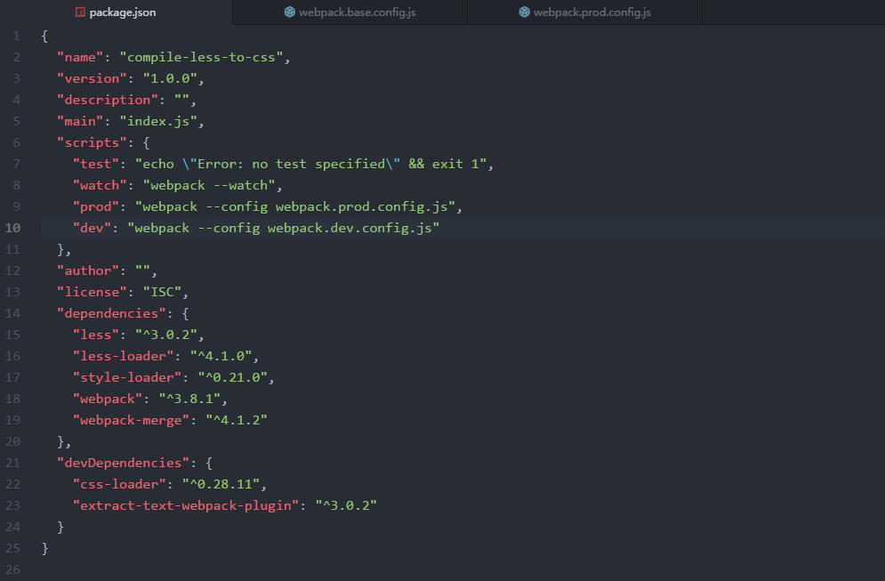

### 测试配置
完全配置好之后，打开命令行工具，执行`npm run dev`,进行开发环境下的编译。这时候我们打开生成的`dist`文件夹，下面就只有`bundle.js`文件，没有`css`文件。<br/>
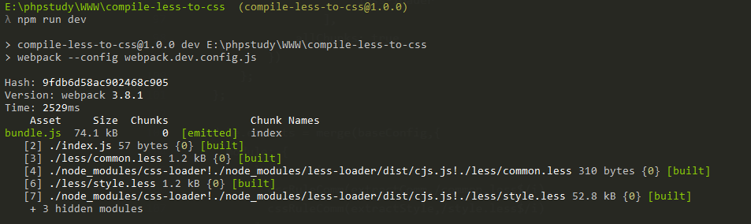<br/>
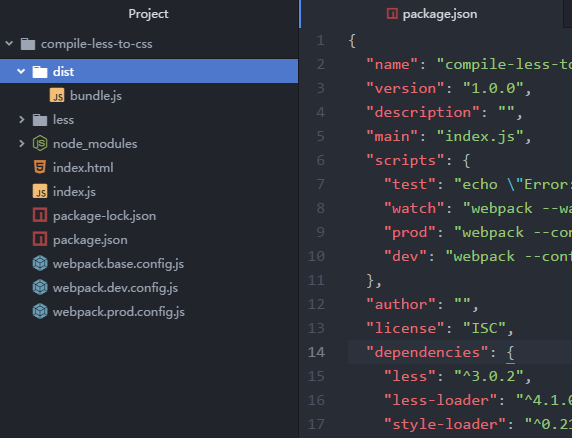<br/>

删除掉这个`dist`文件夹，执行`npm run prod`重新编译一次，这时候再看生成的`dist`文件夹，就已经有`css`文件啦~<br/>
<br/>
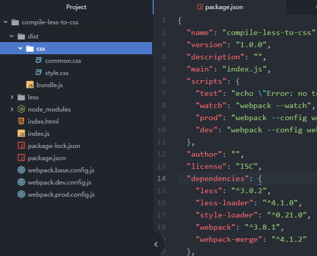<br/>

***
我们这篇文章的配置为了方便讲解，内容是比较简单，在实际项目里面，根据项目的需求我们会增加不同的配置，比如使用`dev-server`、`ES6`的编译等等。只要掌握了核心思路，搭建好文件结构，后面的增加配置也就比较容易啦~
