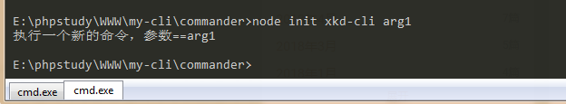
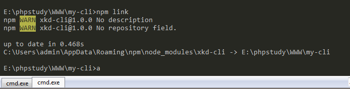
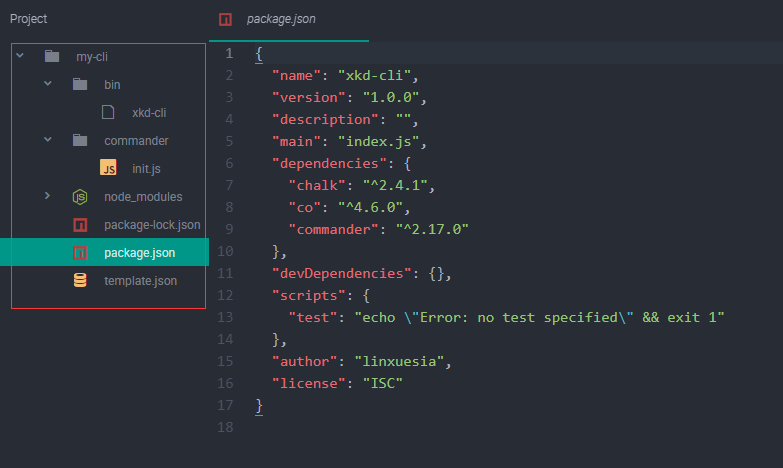

# 缘起

在现代前端逐渐走向工程化、组件化的时代，脚手架工具自是其中必不可少的一环。所谓脚手架，就是自动化工具，它能够将我们在前端工作流程中的一些任务自动处理，减少我们开发中重复的工作，优化开发流程。小到 css 添加前缀，编译 es6+ 语法，再到快速搭建一个完整的项目结构、实现项目的打包发布等等，这些功能，全部可以集成在一个脚手架里面。

基础的脚手架有像gulp、webpack、yeoman这种构建工具，还有集成了构建工具的框架的脚手架 vue-cli、angular-cli等等，搭配上各类插件和功能模块，完全能满足我们的项目需求。尤其是框架脚手架基本做到了开箱即用，方便快速开始项目。

那么，为什么我们还要研究自己搭建脚手架？站在巨人的肩膀上不好嘛？首先，一方面我们是可以通过这个研究和学习的过程，了解脚手架工具背后的原理，提升下自己~另一方面，大家都是不折腾不会死星人，不自己试一试，怎么知道，还是搭好的脚手架更好用呢【误

# 准备工作

* 安装node - node.js 是整个脚手架的核心部分，它拥有读取写入文件的能力
* 安装git - git也是我们的必备工具之一，我们需要从远程仓库获取脚手架的模板文件。
* 安装 commander 模块  - 执行`npm i commander`安装，它可以用来开发你自己的命令行指令。
* 安装 chalk 模块 - 这个模块可以配置命令行工具中输出的文字的样式等等，也是比较常用的功能。
* 安装 co.js 模块  -  这是一个异步处理的工具类，


# commander的基本使用

因为搭建脚手架需要开发命令行指令，要用到 commander ，所以我们应该要先简单学习一下 commander 的基本用法。

首先创建一个空白项目，创建好 package.json。然后执行 npm install commander，下载这个模块。

#### commander 基础API

* .option() - 定义命令的选项，比如`npm i xx -g`，后面的这个`-g`就是一个选项，表示全局安装，我们通过这个 API 可以定义自己选项。
* .version() - 设置这个模块的版本号
* .command() - 定义一个子命令的名字，如`vue init`的`init`，`npm install`的`install`。
* .description() - 如名字所示，为命令设置简短的说明。
* .action() - 注册命令执行时候的回调函数
* .parse() - 解析命令行传入的参数，这里是一个固定的用法`.parse(process.argv)`，其中`process.argv`是 node 里面的一个全局变量。

#### 基础用法测试

下面我们创建一个 commander 文件夹，在文件夹下新建一个init.js ，按照官方文档引入`const program = require('commander')`。

下面我们尝试创建一个叫做 xkd-cli 的命令，为这个命令添加一段描述和执行的内容。

```
program
// 创建一个新的命令名字 传入参数用<>包裹起来
.command('xkd-cli <arg>')
// 为这个命令添加描述
.description('创建一个新的命令')
// 配置执行这个命令的回调函数
.action((res)=>{
  console.log('执行一个新的命令，参数=='+res)
})
// 解析传入的参数
program.parse(process.argv)
```

写好之后，在命令行工具中进入 commander 文件夹，执行`node init xkd-cli arg1`，可以从下图看到，我们的命令已经执行成功，并且执行了回调函数。



那么有关于 commander 的基础用法就先学到这里，我们也可以之后再根据具体需求来查找 API。

[commander 官方文档](https://github.com/tj/commander.js/)


# 创建远程模板

有用过 vue-cli 的应该就会了解，当你执行 vue init 之后，本地会自动创建好一个完整的项目文件夹，包含项目的完整结构和信息，这个就是脚手架的模板文件。如果我们想要创建自己的脚手架，同样也需要一个模板文件噢。

它的原理是当我们执行命令行之后，从远程仓库把对应的模板拉取到本地。那么首先我们需要创建自己的模板，这里我们搭建一个简单的项目结构做为模板文件。


# 定义模板信息文件

创建好的远程模板有一个路径，还有模板名称，我们创建一个 template.json 在根目录下面，记录下这些模板信息。这里我们把上面创建的远程模板 xkd-cli 的地址写上去。

```
// template.json
{
  "xkd-tpl":{
    "link":"your remote template file url here",
    "branch":"master"
  }
}
```


# 创建 cli 文件

在项目目录下，新建一个 bin 文件夹，在这个文件夹下新建 xkd-cli.cmd 文件，全部结构和说明如下：

```
'use strict'
 // 定义脚手架的文件路径
process.env.NODE_PATH = __dirname + '/../node_modules/'
 
const program = require('commander')
 
// 定义当前版本
program
.version(require('../package').version )
 
// 定义使用方法
program
.usage('<command>')

// 定义子命令 子命令的具体操作定义在commander/xx.js里面 
program
.command('init')
.description('创建一个新的项目')
.action(() => {
    require('../command/init')()
})
```

创建好这文件之后，继续编写 init 指令。打开之前创建的 command/init.js 文件，在这个文件我们设置，下载远程仓库的模板文件到本地文件夹。完整的文件内容如下：

```
'use strict'
const exec = require('child_process').exec
const co = require('co')
const prompt = require('co-prompt')
const tpls = require('../templates')
const chalk = require('chalk')

module.exports = () => {
  co(function*() {
    
    // 设置模板名字 
    let tplName = 'xkd-tpl'
    
    // 由用户输入项目名称
    let projectName = yield prompt('Project name: ')
    
    // 获取模板的名字和远程地址
    let gitLink = tpls[tplName].link
    let branch = tpls[tplName].branch

    // git命令，远程拉取项目并自定义项目名
    let cmdStr = `git clone ${gitUrl} ${projectName} && cd ${projectName} && git checkout ${branch}`
    
    // 在控制台输出文字表示正在加载模板
    console.log(chalk.white('\n 初始化模板中...'))

    // 执行 git clone 进程
    exec(cmdStr, (error, stdout, stderr) => {
      if (error) {
        console.log(error)
        process.exit()
      }
      // 成功之后输出
      console.log(chalk.green('\n √ 模板初始化完成!'))
      process.exit()
    })
  })
}
```


# 全局使用

配置好之后，还要把我们配置的命令设置成全局使用，而不是用`node init`这样的方式来使用。打开 package.json，添加上下面这行命令。

```
"bin": {
    "xkd-cli": "bin/xkd-cli"
},
```

然后在根目录下执行`npm link`，这一步指令是指，将一个任意位置的`npm包`链接到全局执行环境。如下图所示执行完之后，就可以直接使用`xkd-cli`指令啦！




# 完整项目结构




参考：

http://blog.fens.me/nodejs-commander/

https://segmentfault.com/a/1190000006190814

https://blog.csdn.net/zhaolandelong/article/details/79782885